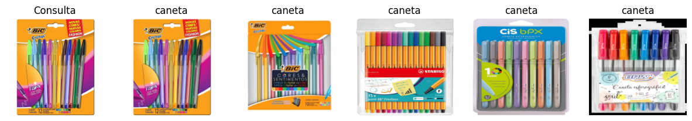

# 🔍 Sistema de Recomendação por Imagens

Este projeto implementa um **sistema de recomendação baseado em imagens** utilizando **PyTorch** e **FAISS**.  
Dado um produto de entrada (ex.: foto de uma caneta), o sistema retorna os **produtos visualmente mais similares** em termos de **cor, formato e textura**, sem utilizar informações textuais como marca, preço ou descrição.

---

## 🚀 Objetivo
O objetivo principal é desenvolver um modelo de **Deep Learning** capaz de:
- Extrair **features visuais** de imagens (usando uma rede pré-treinada ResNet50).  
- Indexar essas features em uma base vetorial.  
- Recuperar os itens **mais similares visualmente** a uma imagem de consulta.  

---

## 🗂 Estrutura do Projeto  

├── dataset/
│ ├── caneta/
│ ├── estojo/
│ ├── lapis/
├── image.png
├── README.md
├── Sistema-de-Recomendação-DIO.ipynb 


📌 O dataset deve estar organizado em **pastas por classe** (como mostrado acima).

---

## ⚙️ Tecnologias Utilizadas
- Python
- PyTorch – extração de embeddings via **ResNet50 pré-treinada**  
- Torchvision – carregamento e transformação de imagens  
- FAISS – busca rápida de vizinhos mais próximos (similaridade)  
- Matplotlib – visualização dos resultados  

---

## ▶️ Como Executar

1. Clone este repositório:
   ```bash
   git clone https://github.com/DenisePotenza/Sistema-de-Recomendacao-DIO.git
   cd sistema-recomendacao-imagens

2. Instale as dependências:

pip install torch torchvision faiss-cpu matplotlib scikit-learn


3. Organize seu dataset no formato descrito acima.

4. Abra o notebook:

jupyter notebook Sistema-de-Recomedação-DIO.ipynb


5. Execute todas as células e teste a busca de similares.

🔎 Exemplo de Uso

Supondo uma imagem de consulta (caneta azul), o sistema retorna os 5 itens mais similares do dataset:

<p align="center">  </p>
📌 Próximos Passos

* Testar com datasets maiores (ex.: centenas de imagens por classe).
* Experimentar outros modelos pré-treinados (EfficientNet, ViT).
* Integrar a solução em uma API Flask/FastAPI para uso em sites e aplicações reais.

👩‍💻 Autora

Projeto desenvolvido por Denise Potenza.